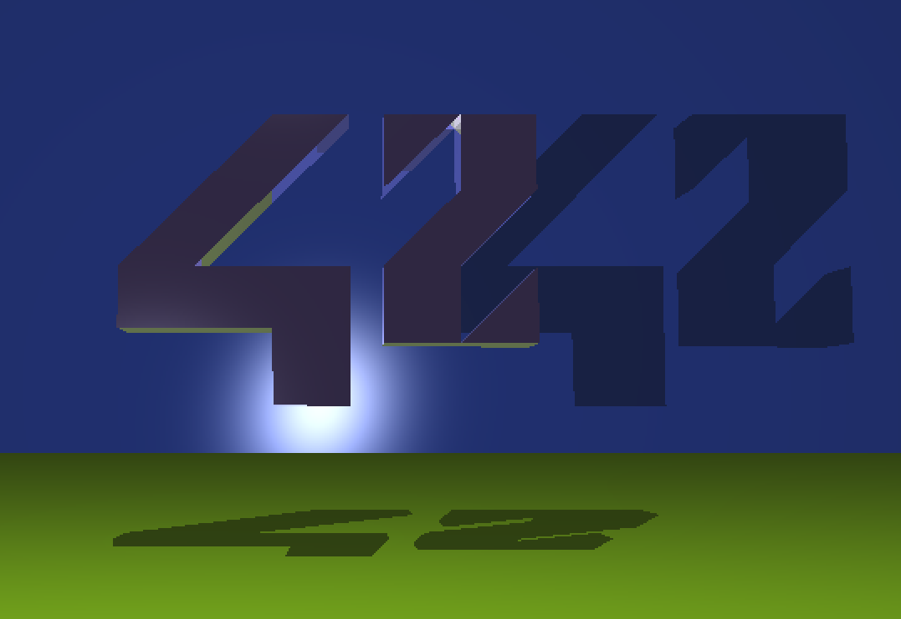

# miniRT

## About

Welcome to **MiniRT**, where we mix pixels and mathematics to create something that resembles a ray tracer!
This project is our humble (but not too humble) attempt to dive into the world of computer graphics, armed with nothing but miniLibX (or MLX42), a keyboard, and an excessive amount of caffeine.

**Why Ray Tracing?**

Ray tracing is that magical process that makes computer-generated images look like they’ve been plucked straight from reality - or at least from a well-lit, impeccably polished version of it.
It’s the secret sauce behind those jaw-dropping visuals in movies and games, minus the multi-million dollar budget and the Hollywood credits.

## Features

🟥 - not implemented yet

🟨 - in development

🟩 - implemented

### Mandatory part

- 🟥 Window management (resizing?, exiting)
- 🟥 3 Simple geometric objects
    * 🟨 Plane
    * 🟨 Sphere
    * 🟥 Cylinder
- 🟥 Objects intersections
- 🟥 Inside of the object
- 🟥 Change object's (unique) properties (diameter, height)
- 🟥 Translation of an object
- 🟥 Rotation of an object
- 🟥 Light management
    * 🟥 Spot brightness
    * 🟥 Hard shadows
    * 🟥 Ambiance lightning
    * 🟥 Diffuse lightning
- 🟥 `.rt` files

### Bonus part

- 🟥 Specular reflection (Phong reflection model)
- 🟥 Color disruption
- 🟥 Colored light
- 🟥 Multi-spot light
- 🟥 2nd degree object(s) (Cone, Hyperboloid)
- 🟥 Bump mapping

### Extras

- 🟥 Skybox (lightning?)
- 🟥 Materials
- 🟥 `.obj` files
- 🟥 Complex objects
- 🟥 Soft shadows
- 🟥 Refraction
- 🟥 Global illumination
- 🟥 Caustic
- 🟥 Multi-threading
