# **MiniRT - A Minimal Ray Tracing Engine in C**

<p align="center">
  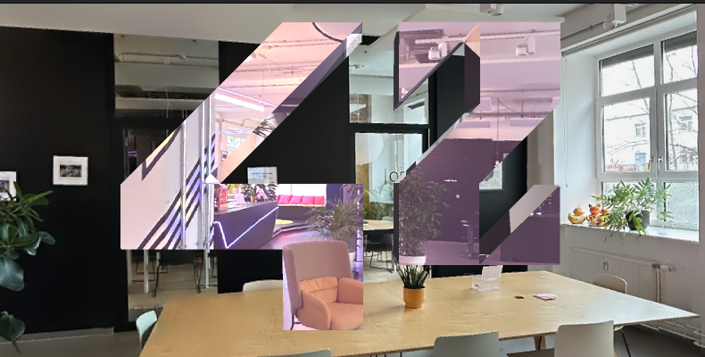
</p>

miniRT is a small but feature-rich ray tracing engine written in C. It renders realistic 3D scenes by simulating the physics of light — tracing rays from the camera through each pixel and calculating their interactions with objects in the world.

Developed as part of the 42 school curriculum, it focuses on mathematical precision, object transformations, and physically inspired lighting models, including reflections, refractions, shadows, and textures — all built from the ground up using the MiniLibX graphical library.

---

## **Table of Contents**

1. [Installation](#-installation)
2. [Running miniRT](#-running-minirt)
3. [Features Overview](#-features-overview)
4. [Rendering Engine](#-rendering-engine)
5. [Antialiasing & Multithreading](#Antialiasing-&0Multithreading)
6. [Objects & Geometry](#-objects--geometry)
7. [Materials & Lighting](#-materials--lighting)
8. [Textures & Skyboxes](#-textures--skyboxes)
9. [File Parsing](#-file-parsing)
10. [Project Structure](#%EF%B8%8F-project-structure)
11. [Gallery](#%EF%B8%8F-gallery)
12. [Author](#-author)

---

## **Installation**

### Dependencies

miniRT depends on:

* **MiniLibX** (graphics library)
* **libft** (custom C utility library)
* **X11** libraries (`Xext`, `X11`)
* **zlib**

To install dependencies on Linux:

```bash
sudo apt-get update
sudo apt-get install build-essential xorg libxext-dev libx11-dev zlib1g-dev
```

---

### Clone the repository

```bash
git clone --recurse-submodules https://github.com/mdomnik/miniRT.git
cd miniRT
```

If you see a warning about MiniLibX, run:

```bash
git submodule update --init --recursive
```

---

### Build

```bash
make
```

To rebuild completely:

```bash
make re
```

---

## **Running miniRT**

To launch a scene:

```bash
./miniRT scenes/example.rt
```

or open your own `.rt` file describing the scene.

Example:

```bash
./miniRT scenes/castle.rt
```

Exit the window with **ESC** or by closing the window directly.

---

## **Features Overview**

| Category         | Features                                                                                                           |
| :--------------- | :----------------------------------------------------------------------------------------------------------------- |
| **Mandatory** | Plane, Sphere, Cylinder, Window management, Transforms, Object intersection, Lighting (ambient + diffuse), Shadows |
| **Bonus**     | Phong specular reflection, Color disruption, Colored lights, Multi-light scenes, Cone & Hyperboloid, Bump mapping  |
| **Extra**      | Skyboxes, Material system, OBJ import, Multithreading, Pattern textures                                            |

---

## **Rendering Engine**

### Phong Reflection Model

Implements **ambient**, **diffuse**, and **specular** components for realistic shading.

<p align="center">
  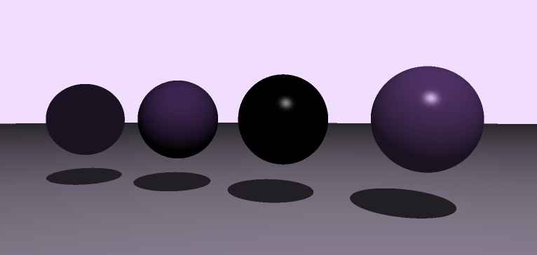
</p>

**How it works:**

* Each ray intersection computes a surface normal.
* The color is determined by summing the Phong components:

  ```
  color = ambient + diffuse + specular
  ```
* Shadows are computed via secondary shadow rays.

---

## **Objects & Geometry**

miniRT supports a full range of analytic primitives and transformations.

<p align="center">
  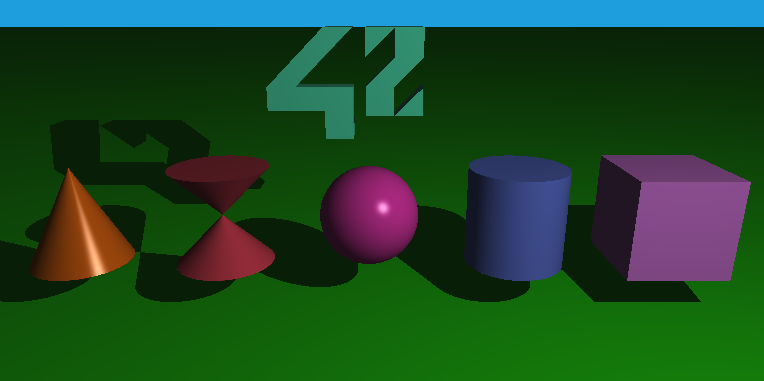
</p>

### Implemented Objects

* **Plane** — infinite plane via normal equation
* **Sphere** — implicit quadratic surface
* **Cylinder** — bounded and capped version
* **Cone, Hyperboloid** — second-degree extensions
* **Cubes(AABB)** — Axis-Aligned Bounding Boxes

<p align="center">
  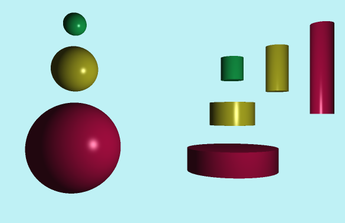
</p>

Objects can be **translated, rotated, and scaled** through transformation matrices.

<p align="center">
  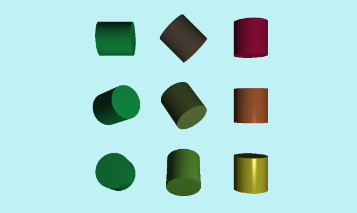
</p>

---

## **Antialiasing & Multithreading**
### Antialiasing

To reduce jagged edges and produce smoother images, miniRT implements supersampling antialiasing.
Instead of casting a single ray per pixel, multiple rays are distributed across subpixel offsets and averaged together.

### How it works:

Each pixel is subdivided into a configurable number of samples (e.g. 4×, 8×).

Rays are randomly jittered or evenly distributed within the pixel boundaries.

The resulting colors are averaged to produce the final pixel color.

This approach greatly enhances visual quality, especially around edges, small geometry, and high-contrast regions.

## **Multithreading**

Rendering is fully parallelized to take advantage of multi-core CPUs.
The image is divided into tiles or horizontal slices, each processed by a dedicated worker thread.

### Key benefits:

Linear performance scaling across available cores.

Independent rendering of each region for optimal CPU utilization.

Thread-safe accumulation and synchronization at frame completion.

By combining multithreading with supersampling, miniRT achieves smooth and efficient rendering — even for complex scenes with reflections, refractions, and texture mapping.

---

## **Materials & Lighting**

### Multi-Light System

Supports multiple colored light sources with adjustable intensity and falloff.

<p align="center">
  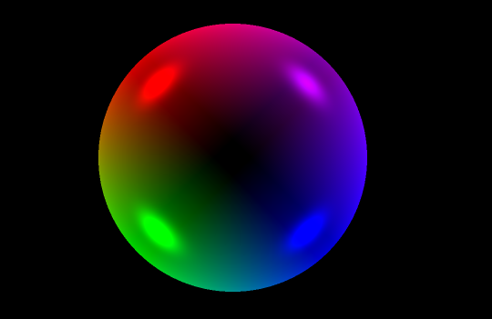
</p>

### Reflection and Refraction

Specular reflection and refraction enhance realism.

<p align="center">
  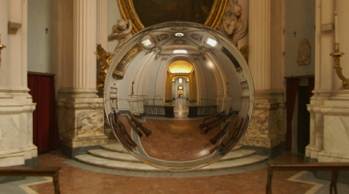
</p>

### Material Examples

<p align="center">
  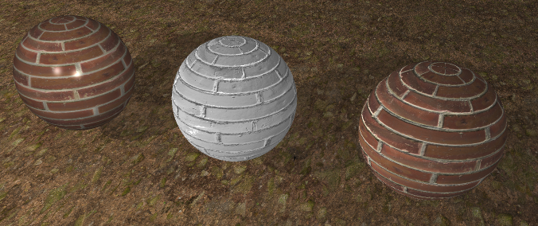
</p>

---

## **Textures & Skyboxes**

### Procedural and UV-Mapped Patterns

<p align="center">
  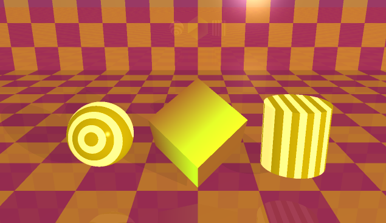
</p>

Includes:

* Checkers
* Stripes
* Gradient maps
* UV-mapped images (PPM)

<p align="center">
  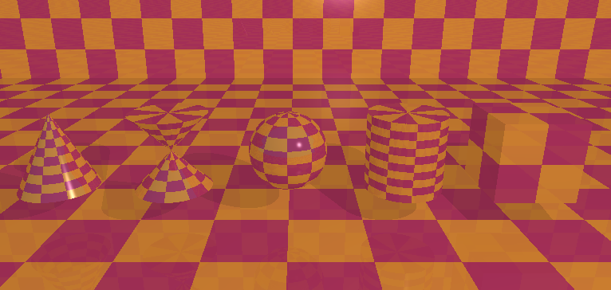
</p>

### Skyboxes and Environment Reflection

Enables realistic world reflections and ambient lighting.

<p align="center">
  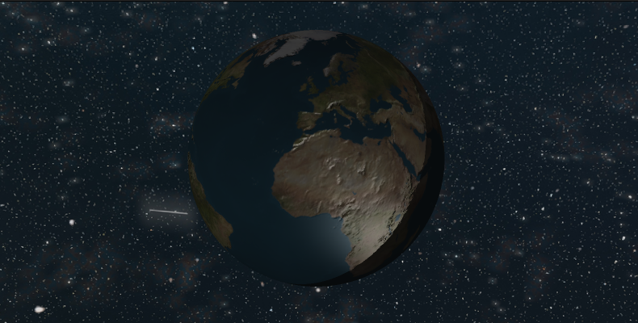
</p>

---

## **File Parsing**

miniRT parses `.rt` scene description files that define:

* Camera position and orientation
* Light sources
* Object definitions
* Material and texture properties

It also supports `.obj` model imports for complex meshes.

<p align="center">
  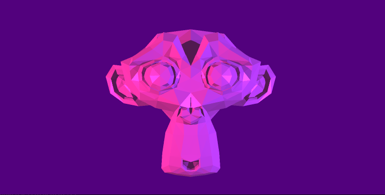
</p>

---

## **Project Structure**

```
miniRT/
├── src/
│   ├── lighting/          # Phong, reflection, transparency
│   ├── intersection/      # Geometry intersections
│   ├── matrix/            # 2x2, 3x3, 4x4 operations
│   ├── textures/          # Procedural and PPM textures
│   ├── parse/             # .rt and .obj parsing
│   ├── render/            # Multi-threaded renderer
│   └── view/              # Camera & transformations
├── lib/
│   ├── libft/             # Custom standard library
│   └── minilibx-linux/    # Graphical backend
└── readmeAssets/          # Screenshots and README images
```

---

## **Gallery**

<p align="center">
  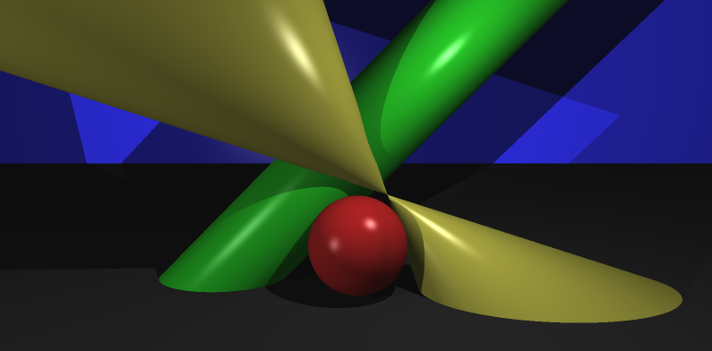<br>
  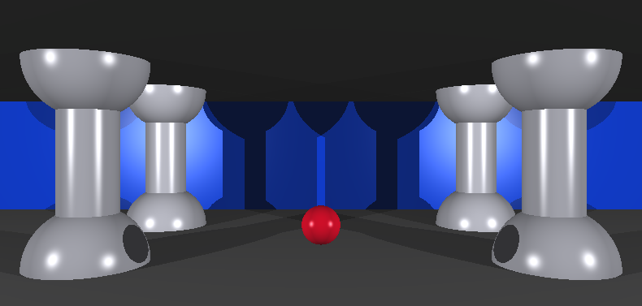<br>
  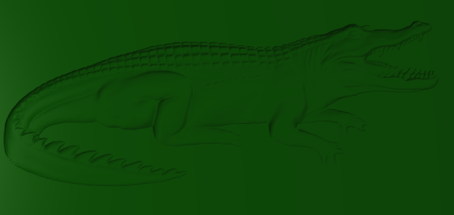<br>
  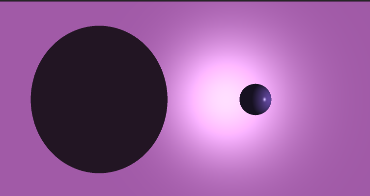<br>
  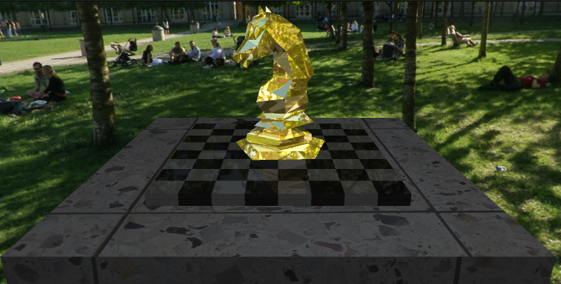
</p>

---

## **Authors**

**Maciej [@mdomnik](https://github.com/mdomnik)** <br>
**Artem [@tesla33io](https://github.com/tesla33io)**
---
